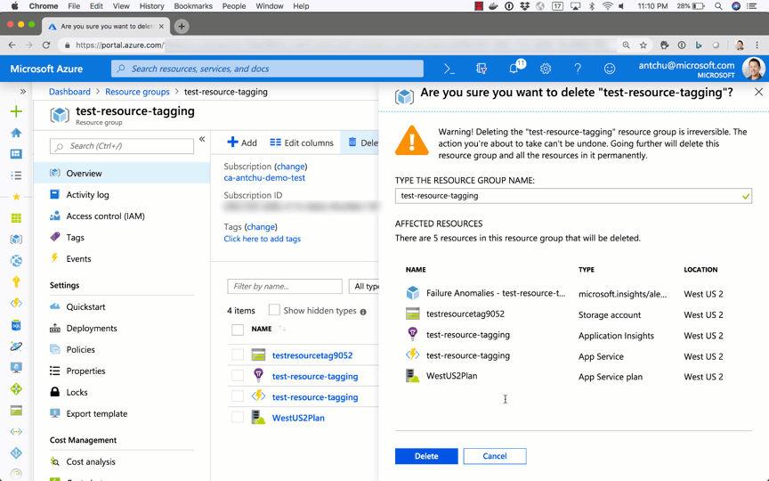

# Real-time Azure Resource Monitor

Powered by PowerShell [Azure Functions](https://docs.microsoft.com/azure/azure-functions/?WT.mc_id=functionsresourcemonitor-github-antchu), [Azure Event Grid](https://docs.microsoft.com/azure/event-grid/?WT.mc_id=functionsresourcemonitor-github-antchu), and [Azure SignalR Service](https://docs.microsoft.com/azure/azure-signalr/?WT.mc_id=functionsresourcemonitor-github-antchu)

**Check out [PowerShell for Azure Functions](https://docs.microsoft.com/azure/azure-functions/functions-create-first-function-powershell?WT.mc_id=functionsresourcemonitor-github-antchu) for more information**

